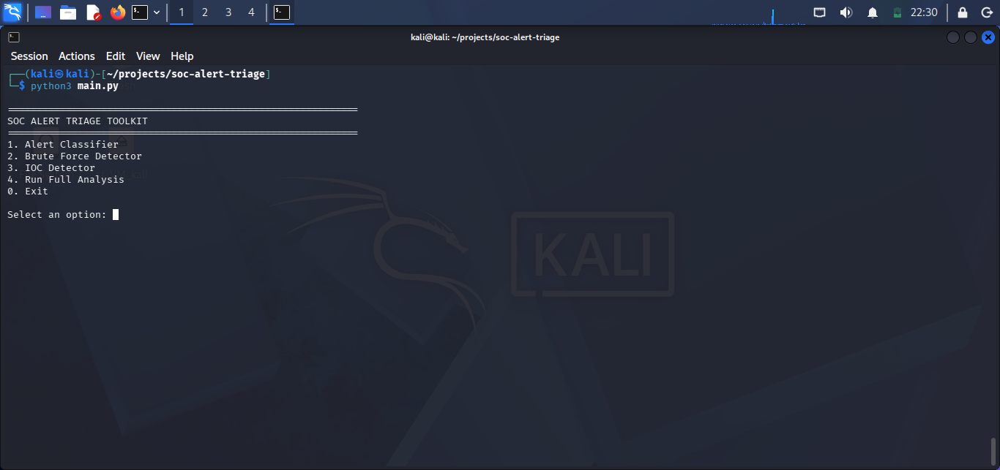
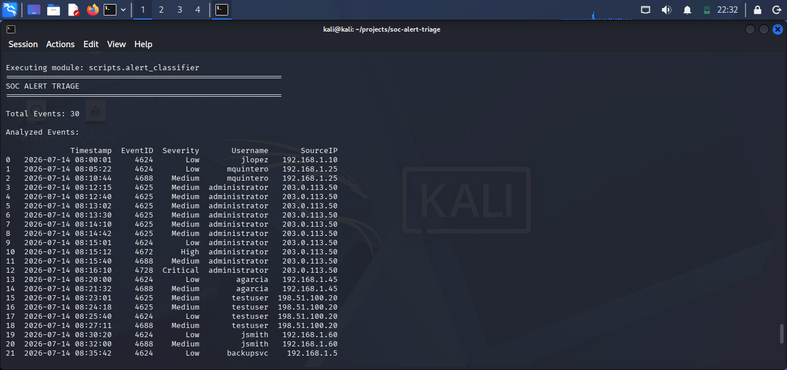
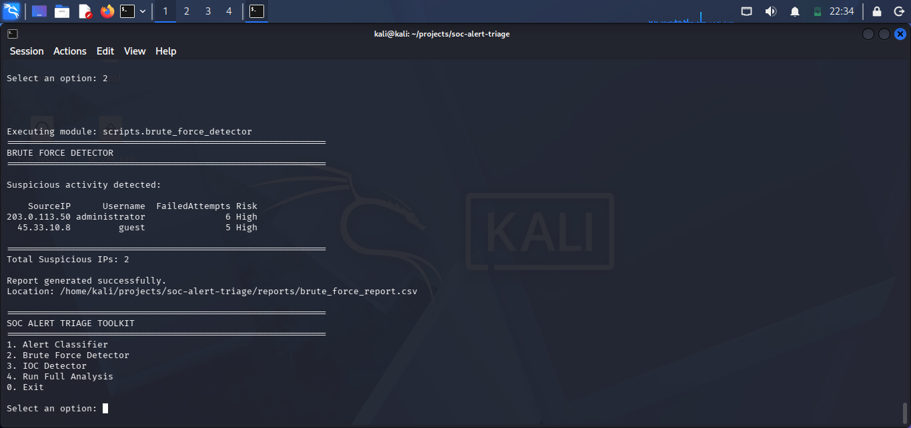
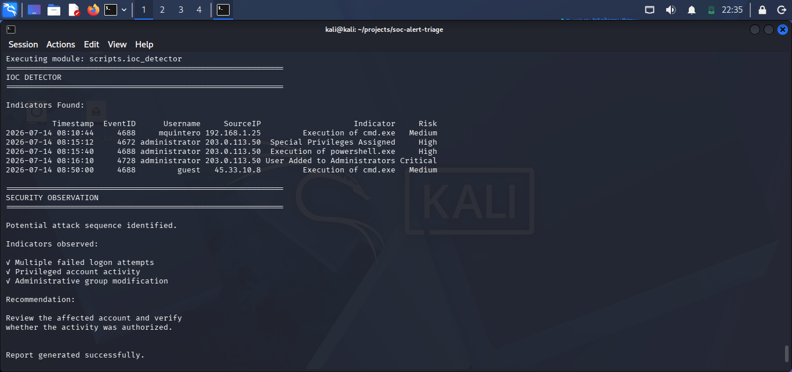

# 🛡️ SOC Alert Triage Toolkit


A Python-based toolkit that simulates common Security Operations Center (SOC) tasks by analyzing Windows Security Event Logs.

The project focuses on detecting suspicious activity, classifying security alerts, identifying brute-force attacks, and detecting basic Indicators of Compromise (IoCs) using simulated Windows event logs.

---

## 📋 Project Overview

SOC Alert Triage Toolkit was developed as a portfolio project to demonstrate fundamental SOC Analyst skills.

The toolkit analyzes Windows Security Event logs stored in CSV format and produces security reports that help prioritize incidents for investigation.

Although the dataset is simulated, the Event IDs and detection logic are based on real Windows Security Events.

---

## ✨ Features

- Alert classification by Windows Event ID
- Severity prioritization (Low, Medium, High, Critical)
- Brute-force attack detection
- Indicator of Compromise (IoC) detection
- CSV report generation
- Interactive command-line menu
- Modular project architecture
- Centralized configuration

---

## 📂 Project Structure

```text
soc-alert-triage/

├── config/
│   ├── __init__.py
│   └── settings.py
│
├── data/
│   └── windows_security.csv
│
├── reports/
│   ├── classified_events.csv
│   ├── brute_force_report.csv
│   └── ioc_report.csv
│
├── scripts/
│   ├── __init__.py
│   ├── alert_classifier.py
│   ├── brute_force_detector.py
│   └── ioc_detector.py
│
├── images/
│
├── main.py
├── requirements.txt
├── LICENSE
└── README.md
```

---

## ⚙️ Installation

Clone the repository:

```bash
git clone https://github.com/miltonquinterog/soc-alert-triage.git
```

Move into the project folder:

```bash
cd soc-alert-triage
```

Install dependencies:

```bash
pip install -r requirements.txt
```

---

## ▶️ Usage

Run the toolkit:

```bash
python3 main.py
```

The interactive menu allows you to execute:

- Alert Classifier
- Brute Force Detector
- IOC Detector
- Full SOC Analysis

---

## 📊 Reports

The toolkit automatically generates the following reports:

| Report | Description |
|---------|-------------|
| classified_events.csv | Security events classified by severity |
| brute_force_report.csv | Suspicious failed authentication attempts |
| ioc_report.csv | Indicators of Compromise detected |

Reports are stored inside the **reports/** directory.

---

## 🖥️ Windows Event IDs Used

| Event ID | Description |
|----------|-------------|
| 4624 | Successful Logon |
| 4625 | Failed Logon |
| 4672 | Special Privileges Assigned |
| 4688 | Process Creation |
| 4720 | User Account Created |
| 4728 | User Added to Administrators Group |

---

## 🛠️ Technologies

- Python 3
- Pandas
- Windows Security Event Logs
- CSV
- Git
- GitHub

---

---

## 📸 Screenshots

### Main Menu



---

### Alert Classifier



---

### Brute Force Detector



---

### IOC Detector


## 🚀 Future Improvements

Planned improvements include:

- MITRE ATT&CK technique mapping
- Sigma rule integration
- JSON report export
- HTML report generation
- Event filtering by date
- Interactive dashboard
- AI-assisted event analysis

---

## 📄 License

This project is licensed under the MIT License.

---

## 👨‍💻 Author

**Milton Quintero**

Cybersecurity Student | SOC Analyst Enthusiast

GitHub:

https://github.com/miltonquinterog
